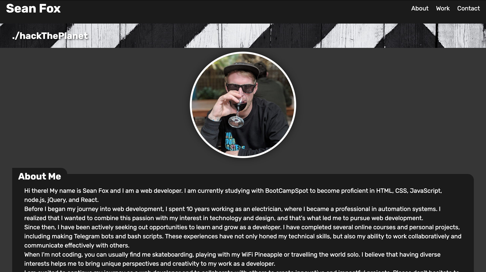

# Sean Fox's portfolio

## Table of Contents
- [Sean Fox's portfolio](#sean-foxs-portfolio)
  - [Table of Contents](#table-of-contents)
  - [Introduction](#introduction)
  - [Technologies Used](#technologies-used)
  - [Content](#content)
    - [Home](#home)
    - [About Me](#about-me)
    - [Work](#work)
    - [Contact Me](#contact-me)
  - [Deployed Link](#deployed-link)
  - [Contact Me](#contact-me-1)

## Introduction
Welcome to my personal website! My name is Sean Fox and I am a web developer currently studying with BootCampSpot to become proficient in HTML, CSS, JavaScript, node.js, jQuery, and React. I have a background in automation systems as an electrician, and have since combined that passion with my interest in technology and design. This website serves as a portfolio for my work and a way to connect with potential collaborators or employers. 

## Technologies Used
The following technologies were used in the development of this website:
- HTML
- CSS

## Content
This website contains the following sections:
- Home
- About Me
- Work
- Contact Me

### Home
The home page includes a header with my name and navigation links to the other sections of the site. The hero banner displays a quote and the photo section includes a picture of me.

### About Me
The about me section provides information about my background and experience as a web developer. I discuss my transition from electrician to developer, as well as my completed online courses and personal projects. I also talk about my hobbies and how they help me bring unique perspectives and creativity to my work.

### Work
The work section features several of my completed projects. Each project includes a link to the deployed site, an image, and information about the technologies used.

### Contact Me
The contact me section provides links to my Telegram, LinkedIn, email, and GitHub accounts.

## Deployed Link
The deployed link to this website can be found here: [Sean Fox // Web Developer](https://drgunbot.github.io/My-Portfolio)

## Contact Me
If you would like to connect or chat, please feel free to reach out to me via one of the following links:
- [Telegram](https://t.me/ninjaidev)
- [LinkedIn](https://www.linkedin.com/in/sean-fox-9808a8162/)
- [Email](mailto:seanfox1989@gmail.com)
- [GitHub](https://github.com/DrGunbot)
